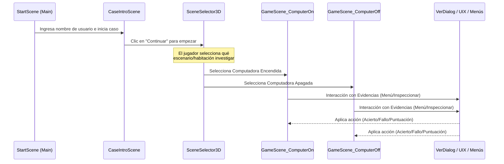
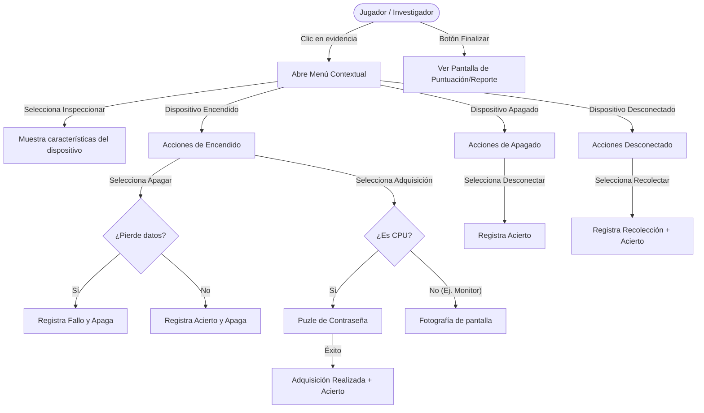

# Manual Técnico - Evidentia (Simulador Forense Digital)

## 1. Introducción
**Evidentia** es un videojuego de simulación desarrollado en **Godot 4**. El objetivo principal del juego es entrenar al usuario en los procedimientos de **informática forense**, simulando la llegada a una escena del crimen digital donde se deben tomar decisiones críticas (encender, apagar, desconectar, recolectar o reportar evidencias) minimizando la alteración de los datos.

## 2. Arquitectura del Proyecto
El juego sigue una arquitectura basada en **Nodos y Escenas** característica de Godot, con un fuerte enfoque en variables globales (Singletons/Autoloads) para mantener el estado de la partida entre las distintas escenas 3D y menús 2D de interfaz de usuario (UI).

### 2.1. Configuración Principal (`project.godot`)
- **Escena principal (`run/main_scene`)**: `uid://7stme2pg5661`
- **Autoloads (Singletons)**:
  - `GameManager`: Se encarga de la lógica central de la partida, puntuación y registro de acciones (bitácora forense).
  - `Global`: Almacena información persistente del jugador como `player_name` y `selected_case`.

## 3. Scripts y Lógica Principal

### 3.1. GameManager (`res://scripts/GameManager.gd`)
Es el corazón lógico del juego.
- **Responsabilidad**: Rastrear puntos, fallos, aciertos y errores críticos.
- **Bitácora**: Registra todas las acciones tomadas por el jugador con una marca de tiempo ("timestamp") usando `Time.get_datetime_string_from_system()`.
- **Exportación**: Expone el método `guardar_bitacora_en_archivo()` que guarda toda la secuencia de la investigación en el archivo del sistema: `user://bitacora_forense.txt`.
- **Variables Clave**: `aciertos`, `fallos`, `errores_criticos`, `evidencias_recolectadas`, `puntuacion`.

### 3.2. Sistema de Evidencias (`res://scripts/EvidenciaBase.gd`)
Este script define la clase `EvidenciaBase` que hereda de `Area2D` (o en su adaptación 3D a través de clics en el viewport). Actúa como la plantilla para cada objeto interactuable en la escena.
- **Estados posibles de una evidencia**: 
  - `encendido`
  - `apagado`
  - `desconectado`
  - `recolectado`
  - `reportado`
  - `adquisicion_realizada`
- **Atributos (`caracteristicas`)**: Define si una evidencia "pierde datos al apagar" o si "es extraíble". Esto es vital para las mecánicas de puntuación.
- **Acciones (`aplicar_accion`)**: Dependiendo de la acción seleccionada y del estado actual del objeto, el sistema evalúa si fue una decisión forense correcta o incorrecta, comunicándose con `GameManager` para actualizar el log y la puntuación. Emite la señal `estado_cambiado`.

### 3.3. Interfaz de Interacción y Menús (`res://scripts/popup_menu_evidencia.gd`)
Al hacer clic sobre una evidencia, se despliega un menú contextual dinámico basado en las opciones viables según su `estado` actual.
- Si está **encendido**: Muestra "Inspeccionar", "Apagar", "Adquisición".
- Si está **apagado**: Muestra "Inspeccionar", "Desconectar".
- Si está **desconectado**: Muestra "Inspeccionar", "Recolectar".
Estas opciones guían al jugador por la cadena de custodia estándar (Adquisición -> Apagado limpio/Tirón de cable -> Desconexión -> Recolección -> Reporte).

### 3.4. Escenas y Navegación
- **`start_scene.gd`**: Menú inicial que captura el nombre del jugador (`Global.player_name`) e inicia el caso.
- **`case_intro_scene.gd`**: Presenta el trasfondo de la investigación (ej. fuga de datos o allanamiento).
- **`scene_selector_3d.gd`**: Un hub en 3D que permite al jugador navegar e ingresar a la simulación específica haciendo clic en las puertas.
- **`game_scene_base.gd`**: Define el entorno de la escena del crimen. Bloquea la interacción al inicio y muestra un panel de ayuda, conectando también los paneles de información (UI) al `GameManager` (ej. `score_label` y `log_panel`). Oculta/muestra el mouse mediante `Input.set_mouse_mode()`.

#### Diagrama de Flujo de Navegación de Escenas

## 4. Flujo Forense y Sistema de Puntuación
El núcleo de la jugabilidad es el manejo de contingencias:
1. **Adquisición en Vivo vs. Apagado**: Si la evidencia es una CPU encendida y el jugador decide interactuar, se desencadena un puzle o diálogo de contraseña (`abrir_dialogo_clave()`). Conseguirlo suma aciertos.
2. **Pérdida de Datos**: Si un dispositivo tiene `pierde_datos_al_apagar = true` y el jugador lo apaga directamente estando encendido en lugar de hacer una adquisición, se registra un fallo forense (`GameManager.registrar_fallo()`).
3. **Cadena Secuencial**: Las acciones deben ser cronológicas. Intentar desconectar una máquina encendida registrará un error. Recolectar algo evidenciado sin antes reportarlo también causará una penalidad.

### Diagrama de Flujo de Decisiones del Usuario (User Journey)
A continuación se detalla cómo el usuario (Jugador) interactúa con una pieza de evidencia (Ej. Computadora) en la escena:

## 5. UI y Componentes Auxiliares
- **InfoPanel / CanvasLayer**: Mantiene un `RichTextLabel` que se imprime en pantalla de forma constante, revelando la historia procedimental de la bitácora que luego será exportada.
- **VerDialog (`VerDialog.tscn`)**: Permite inspeccionar una evidencia de cerca y leer sus características visuales y técnicas.

## 6. Perspectivas de Exportación y Despliegue
- La exportación principal configurada apunta a un entorno jugable de PC (posiblemente Windows/Linux, y como lo muestra la carpeta `web-build`, exportación HTML5 para jugarse en navegadores web).
- Archivo de variables export (`export_presets.cfg`) maneja estos perfiles de build.

## 7. Notas de Desarrollo Activas
- Algunos elementos de `EvidenciaBase` aún mencionan `Area2D`, a pesar de haber entornos 3D en uso, sugiriendo un diseño mixto (entornos 3D con overlays o raycasting 2D) o una migración de 2D a 3D en proceso.
- La organización en la carpeta `/scripts/` y `/Scenes/` muestra modularidad y separación de responsabilidades.
